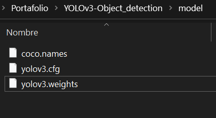
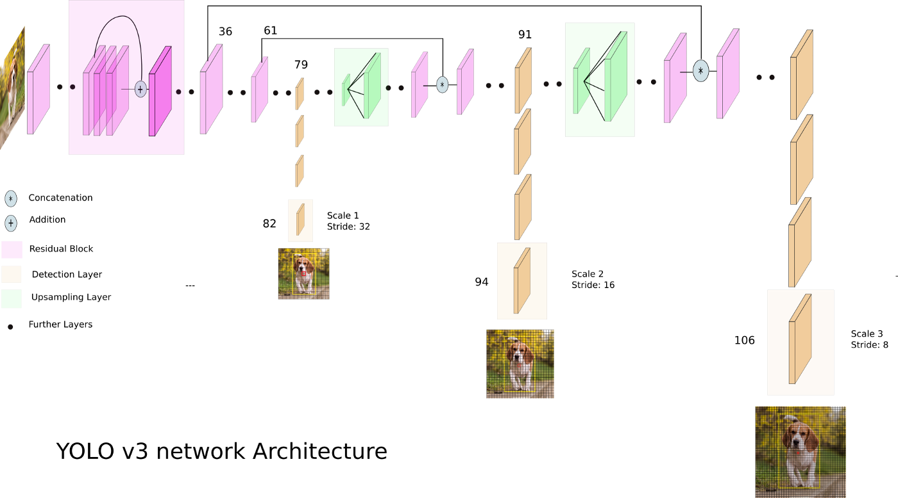
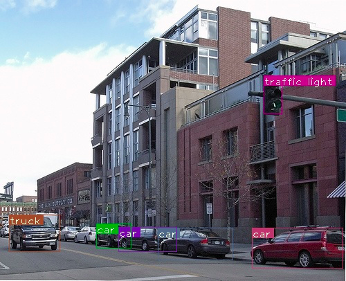
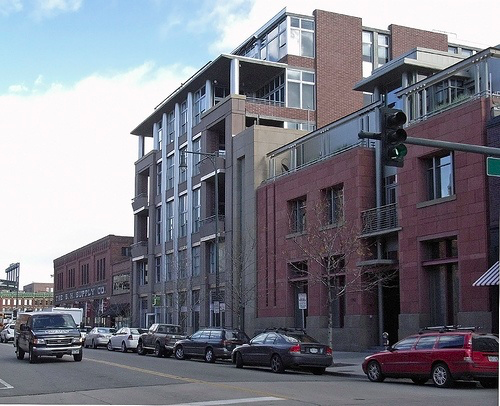
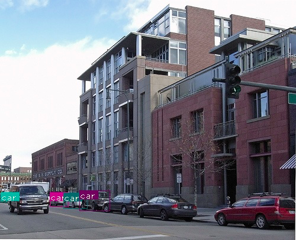
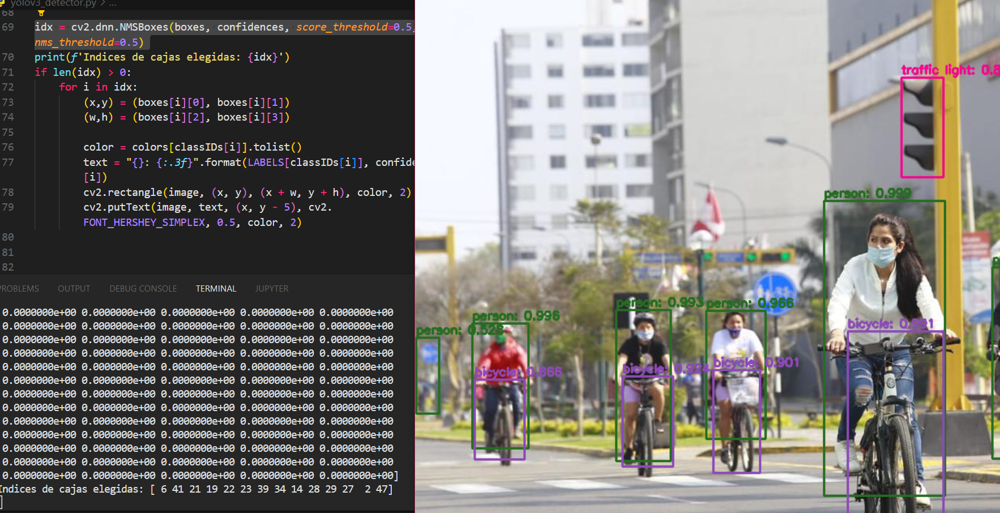

**<h1> Detección de objetos con Yolov3 </h1>**
Se aplicará el modelo de Yolov3, usando el módulo DNN de OpenCV, nos guiamos del [tutorial](https://opencv-tutorial.readthedocs.io/en/latest/yolo/yolo.html) de OpenCV, cubriendo los siguientes pasos:

- Descargar los pesos
- Descargar la configuración del modelo
- Descargar el archivo coco.names (80 clases clasificadas)

<b>Guardamos los archivos descargados en la carpeta model</b>

 
 

<h2>Yolov3</h2>

Hacemos uso del modulo de redes neuronales profundas cv2.dnn, de tal manera poder invocar 
el modelo darknet (propio de yolov2), para más información las mejoras de Yolov3 ir 
[aquí](https://towardsdatascience.com/yolo-v3-object-detection-53fb7d3bfe6b).

### **En resumen**
YOLO v2 a menudo tuvo problemas con la detección de objetos pequeños,
le faltaban algunos de los elementos más importantes que ahora son básicos 
en la mayoría de los algoritmos de última generación. 
Sin bloques residuales, sin conexiones salteadas y sin sobremuestreo. 

Primero, YOLO v3 usa una variante de Darknet, que originalmente tiene una red de 53 capas entrenada en Imagenet.
Para la tarea de detección, se apilan 53 capas más, esta es la razón detrás de la lentitud de YOLO v3 en comparación con YOLO v2. 

<b>La característica más destacada es que realiza detecciones en tres escalas diferentes.</b>

La forma del kernel de detección es 1 x 1 x (B x (5 + C)). Aquí B es el número de cuadros delimitadores 
que puede predecir una cuadrícula en el mapa de características, "5" es para los 4 atributos del cuadro delimitador y la confianza de un objeto, 
y C es el número de clases. YOLO v3 es entrenado en COCO, B = 3 y C = 80

YOLO v3 hace predicciones en tres escalas, que se dan precisamente al reducir las dimensiones de la imagen de entrada en 32, 16 y 8 respectivamente.
YOLO v3, en total utiliza 9 cajas de anclaje. Tres para cada escala. 

Las detecciones en diferentes capas ayudan a abordar el problema de la detección de objetos pequeños, una queja frecuente con YOLO v2. Las capas sobremuestreadas concatenadas con las capas anteriores ayudan a preservar las características de grano fino que ayudan a detectar objetos pequeños.

La capa de 13 x 13 es responsable de detectar objetos grandes, mientras que la capa de 52 x 52 detecta los objetos más pequeños, y la capa de 26 x 26 detecta objetos medianos. Aquí hay un análisis comparativo de diferentes objetos recogidos en el mismo objeto por diferentes capas.

 

<b>Detección a escala 1, vemos que se recogen objetos algo grandes. Pero no detectamos algunos autos.</b>

 

<b>No hay detecciones en la escala 2.</b>

 

<b>Detección a la mayor escala (3). Mira como solo se recogen los objetos pequeños, que no fueron detectados por la escala 1.</b>

### Archivo yolov3_detector.py

Ejecutamos este archivo, y modificamos en la línea 20, sobre la imagen persona que queramos predecir.
Cabe resaltar que según la versión de opencv que se tenga, se abarcará la línea 39 de la siguiente manera:

- opencv-pyton < 4.4 : [ln[i[0]-1] for i in net.getUnconnectedOutLayers()]
- opencv-pyton >= 4.5 : [ln[i-1] for i in net.getUnconnectedOutLayers()]

De igual manera para que pueda ejecutar Non-max supression, se recomienda tener las version 4.5 de opencv
Para más información visite [aquí](https://stackoverflow.com/questions/70537488/cannot-import-name-registermattype-from-cv2-cv2)

El resultado final del dibujado de cuadros delimitadores en una imagen se ve de la siguiente manera:

